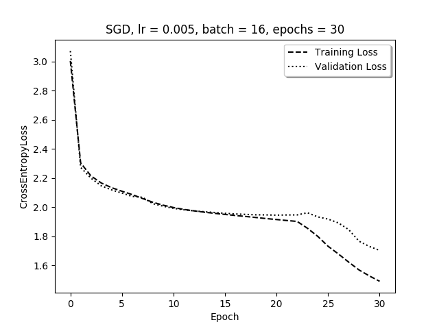

# HW2 CS446
**Daryl Drake**

1. **Singular Value Decomposition and norms**
	* A  
		*	$ ||A||_{2} = ||U\Sigma V^{T}||_{2} $ ***invarient under unitary transformation** 
		*	$ ||A||_{2} = ||\Sigma V^{T}||_{2} $   
		*	$ ||A||_{2} = ||\Sigma||_{2} $  
		*	$ ||A||_{2} = sup_{x \neq 0} \frac{||\Sigma x||_{2}}{||x||_{2}} $  
		*	$ ||A||_{2} = sup_{x \neq 0} \frac{\sum^{n}_{i = 1} \sigma_{i}^{2} x_{i}^{2}}{\sum^{n}_{i = 1} x_{i}^{2}} $
		* The supremum is achieved when $x = e_{i}$ where $e_{i}$ is the $i^{th}$ standard ordered basis where $i$ is the index of $\sigma_{max}$
		* $ \therefore ||A||_{2} = \sigma_{max}$
   * B
   		*	$ ||A||_{2} = sup_{x \neq 0} \frac{||A x||_{2}}{||x||_{2}} $
   		* 	$ ||A||_{2} = \frac{||A y||_{2}}{||y||_{2}} $ ***where y is the value of x at supremeum**
   		*  $ \therefore ||A||_{2} * ||y||_{2}= ||Ay||_{2}$
   		*  $ \forall x |x \neq y,  \frac{||A x||_{2}}{||x||_{2}} < \frac{||A y||_{2}}{||y||_{2}}$
   		*  $ \therefore \forall x |x \neq y, \frac{||A x||_{2}}{||x||_{2}} < ||A||_{2}$
   		*  $ \therefore \forall x |x \neq y, ||A x||_{2} < ||A||_{2} * ||x||_{2}$
   		*  $ \therefore \forall x, ||A x||_{2} \leq ||A||_{2} * ||x||_{2}$
   * C
   		*  $||A||_{F} = \sqrt{\sum_{i=1}^{n} \sum_{j=1}^{d} A_{i,j}^{2}} $
   		*  $A^{T}A \implies (A^{T}A)_{i,j} = \sum_{k=1}^{n} A_{i,k}^{T} A_{k, j}$
   		*  $\therefore (A^{T}A)_{i,i} = \sum_{k=1}^{n} A_{i,k}^{T} A_{k, i}$
   		*  $\therefore (A^{T}A)_{i,i} = \sum_{k=1}^{n} A_{k, i}^{2}$
   		*  $\therefore tr(A^{T}A) = \sum_{i=1}^{n} (A^{T}A)_{i,i}$
   		*  $\therefore tr(A^{T}A) = \sum_{i=1}^{n} \sum_{k=1}^{n} A_{k, i}^{2}$
   		*  $\therefore ||A||_{F}^{2} = tr(A^{T}A)$
   		*  $\therefore ||A||_{F} = \sqrt{tr(A^{T}A)}$
   * D
   		*	$||A||_{F} = ||U \Sigma V^{T}||_{F}$ ***invarient under unitary transformation**
   		* 	$||A||_{F} = ||\Sigma||_{F}$ 
   		*  $||A||_{F} = \sqrt{tr(\Sigma^{T}\Sigma)}$
   		*  $(\Sigma^{T}\Sigma)_{i,i} = \sigma_{i}^{2}$ ***by 1-C**
   		*  $\therefore tr(\Sigma^{T}\Sigma) = \sum_{i=1}^{n}\sigma_{i}^{2}$
   		*  $\therefore ||A||_{F} = \sqrt{\sum_{i=1}^{n}\sigma_{i}^{2}}$
   * E
   * F
   		* $A = U\Sigma V^{T}$
   		* $A^{+} = V\Sigma^{-1} U^{T}$
   		* $AA^{+} = U\Sigma V^{T}V\Sigma^{-1} U^{T}$
   		* $AA^{+} = U\Sigma \Sigma^{-1} U^{T}$
   		* $AA^{+} = U U^{T}$
   		* $AA^{+} = I_{mxm}$
   		* $A^{+}A = V\Sigma^{-1} U^{T}U\Sigma V^{T}$
   		* $A^{+}A = V\Sigma^{-1} \Sigma V^{T}$
   		* $A^{+}A = V\ V^{T}$
   		* $A^{+}A = I_{nxn}$ ***If full rank $I$ becomes the identity, else this becomes a sub identity with some zeros along the diagonal**
   		* $\therefore ||A^{+}A||_{2} = ||I_{nxn}||_{2} = 1$ ***all the singular values of I are 1**
   		* $\therefore ||AA^{+}||_{2} = ||I_{mxm}||_{2} = 1$
   		* $\therefore ||A^{+}A||_{F} = ||I_{nxn}||_{F} = \sqrt{r}$ ***There are r singular values of $I$ with value 1** 
   		* $\therefore ||AA^{+}||_{F} = ||I_{mxm}||_{F} = \sqrt{r}$
   * G
   		* When $A$ has linearly independent rows and $\therefore AA^{+} = I$
   		* construct $A$ suchthat $v$ is in the null space of $A^{+}$ and such that $A$ has linearly independent rows. 
2. **Singular Value Decomposition and image reconstruction**
	* A
   * B
   		*	
   		* It appears that the log singular value plot is not linear
   * C
   		*	
3. **Neural Networks on XOR**
   * A
   * B
   * C
   		*	
   		* Since we have multiple descicion boundries we are able use this neural network to classify the nonlinearity of XOR
4.	**Convolutional Neural Networks**	
	* A
   * B
   * C
   		*	
   * D
   		*	
   * E
   		*	
   		* Increasing the batch size caused the execution time to significantly decrease when compared to 4-c and 4-d, however without a decaying learning rate it also appeared to over fit the data. The decaying learning rate produced the model with the lowest validation loss. Small batch size and no decaying learning rate performed the worst and seemed to suffer the most overfitting.
   * F
   		*	
   * G		
   		* I achieved an accuracy of 73.333% when using K-NN on the feature vector representation of the data tested on the validation set. I used sklearn to create and test the accuracy of a K-NN classifier using a KDTree backend.
   		
   		
   		~~~python
		import hw2_utils as utils
		import hw2 as hw
		import numpy as np
		import torch.optim as optim
		import torch.nn as nn
		import torch
		from sklearn.neighbors import KNeighborsClassifier
		import matplotlib.pyplot as plt 
   			
		net = hw.DigitsConvNet()
		train, val = utils.torch_digits()
		n_epochs = 30
		optimizer = optim.SGD(net.parameters(), lr=0.005)
		scheduler = optim.lr_scheduler.ExponentialLR(optimizer, 0.95)
		loss_func = nn.CrossEntropyLoss()
			
		train_el, val_el = hw.fit_and_validate(net, optimizer, loss_func, train, val, n_epochs, batch_size=16, sch=scheduler)
			
		digits, labels, val_X, val_Y = utils.torch_digits(mode=True)
			
		labels = labels.cpu().detach().numpy()
		val_Y = val_Y.cpu().detach().numpy()
		intermediate_train = net.intermediate(digits).cpu().detach().numpy()
		intermediate_val = net.intermediate(val_X).cpu().detach().numpy()
			
		knn = KNeighborsClassifier(n_neighbors=5, algorithm='kd_tree')
		knn.fit(intermediate_train, labels)
		accuracy = knn.score(intermediate_val, val_Y) 
		print(accuracy)
		
   		~~~
   		
   

