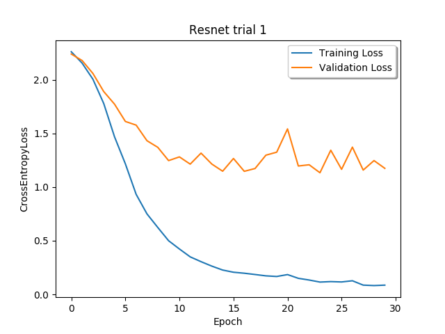
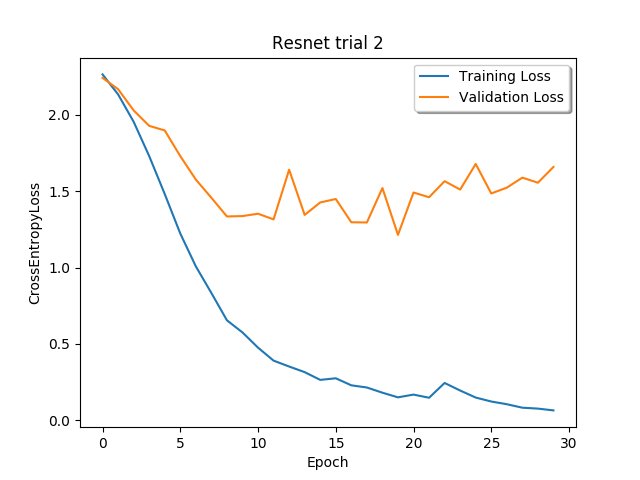
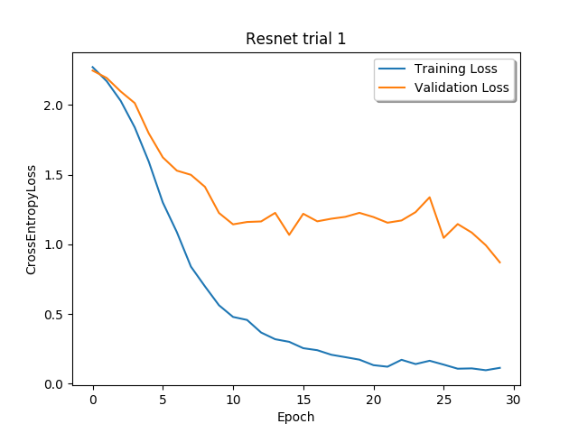
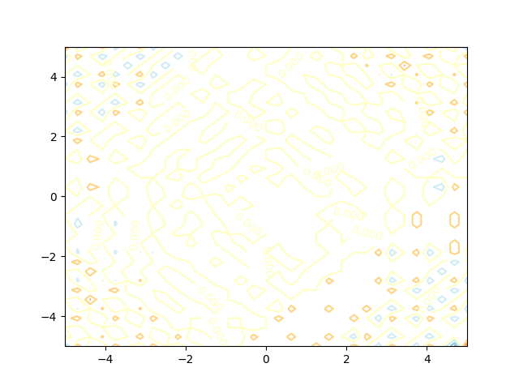
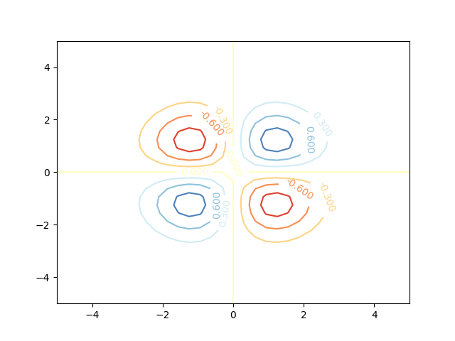
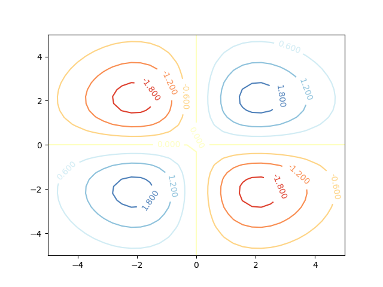
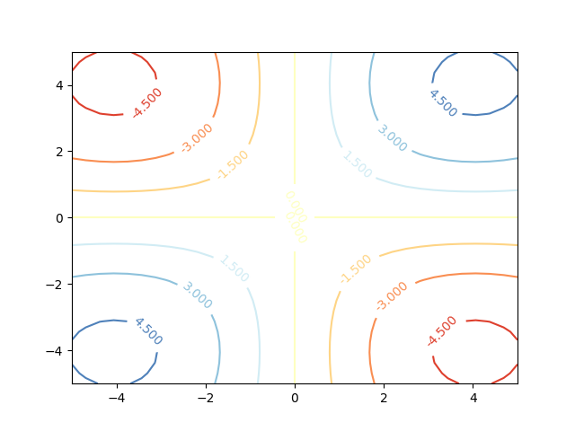

1.	**The ln-sum-exp and cross entropy**
	*	A
		*	$H = \nabla^2 g(z)$ 
		*  $(\nabla g(z))_i = \frac{\partial}{\partial z_i}\sum_{n=1}^k exp(z_n) \sum_{n=1}^k nexp(z_n)$
		*  $\therefore  (\nabla g(z))_i = \sum_{n=1}^k nexp(z_n) D$
		*  Where $D_i = \frac{\partial}{\partial z_i}\sum_{n=1}^k exp(z_j)$
		*  $D_i = \sum_{n=1}^k \frac{\partial}{\partial z_i} exp(z_n)$
		*  When $i \neq n, \sum_{n=1}^k \frac{\partial}{\partial z_i} exp(z_n) = 0$
		*  $\therefore D_i = exp(z_i)$
		*  $\therefore (\nabla g(z))_i  = exp(z_i) \sum_{n=1}^k nexp(z_n)$
		*  $(\nabla^2 g(z))_{i,j} = \frac{\partial}{\partial z_j} [exp(z_i) \sum_{n=1}^k nexp(z_n)$]
		*  $(\nabla^2 g(z))_{i,j} = \frac{\partial}{\partial z_j} [exp(z_i)] \sum_{n=1}^k nexp(z_n) + \frac{\partial}{\partial z_j} [\sum_{n=1}^k nexp(z_n)] exp(z_i) $
		*  Where $i \neq j \frac{\partial}{\partial z_j} [exp(z_i)] = 0$
		*  $\frac{\partial}{\partial z_j} [\sum_{n=1}^k nexp(z_n)] exp(z_i) = - exp(z_i) nexp(z_j)$
		*  $\therefore (\nabla^2 g(z))_{i,i} = -1 + exp(z_i) \sum_{n=1}^k nexp(z_n)$
		*  $\therefore (\nabla^2 g(z))_{i,i} = -1 + \sum_{n=1}^k exp(z_i)nexp(z_n)$
		*  $\therefore (\nabla^2 g(z))_{i,i} = \sum_{n=1,n\neq i}^k exp(z_i)nexp(z_n)$
		*  $(\nabla^2 g(z))_{i,i} = exp(z_i) \sum_{n=1,n\neq i}^k nexp(z_n)$
		*  Where $i \neq j, (\nabla^2 g(z))_{i,j} = - exp(z_i) nexp(z_j)$
		*  $(\nabla^2 g(z))_{i,j} = (\nabla^2 g(z))_{j,i}$ as $exp(z_i) nexp(z_j) = exp(z_j) nexp(z_i)$
		*  $\therefore$ $(\nabla^2 g(z))$ is symetric 
		*  Positive semi definitness requires all diagonal entries be greater than or equal to the absolute sum of the row and column it is in
		*  This is easy to see from the above construction of H as the diagonal entries are equal to the sum of the row / columns 
	*	B
	* 	C
		*	$\lim_{r \to \infty}  \ell_r(z) = \lim_{r \to \infty} \frac{1}{r} ln(1 + exp(rz))$
		*  $\lim_{r \to \infty}  \ell_r(z) = \frac{\frac{\partial}{\partial r} ln(1 + exp(rz))}{\frac{\partial}{\partial r} r}  $
		*  $\lim_{r \to \infty}  \ell_r(z) = \frac{\partial}{\partial r} ln(1 + exp(rz))$
		*  $\lim_{r \to \infty}  \ell_r(z) = \frac{z * exp(rz)}{1 + exp(rz)}$
		*  $\lim_{r \to \infty}  \ell_r(z) = \frac{\frac{\partial}{\partial r}  z * exp(rz)}{\frac{\partial}{\partial r}  [1 + exp(rz)]}$

				
2. **On initialization**
	*	A
		*	$f(x, W, v) =  \sum_{j=1}^{m} v_j \sigma (\langle w_j, x \rangle )$
		* 	$\widehat{R} = \ell(f(x, W v), y)$
		*  $\frac{\partial \widehat{R}}{\partial v_k} = \frac{\partial}{\partial v_k} \ell(f(x, W v), y)$
		*  $\frac{\partial \widehat{R}}{\partial v_k} = \frac{\partial}{\partial v_k} \ell(\sum_{j=1}^{m} v_j \sigma (\langle w_j, x \rangle ), y)$
		*  $\frac{\partial \widehat{R}}{\partial v_k} = \frac{\partial \ell}{\partial v_k} \frac{\partial}{\partial v_k}[\sum_{j=1}^{m} v_j \sigma (\langle w_j, x \rangle )]$
		*  $\frac{\partial \widehat{R}}{\partial v_k} = \frac{\partial \ell}{\partial v_k} \sum_{j=1}^{m} \frac{\partial}{\partial v_k} [v_j \sigma (\langle w_j, x \rangle )]$
		*  when $k \neq j, \frac{\partial}{\partial v_k} [v_j \sigma (\langle w_j, x \rangle )] = 0$
		*  $\therefore \frac{\partial \widehat{R}}{\partial v_k} = \frac{\partial \ell}{\partial v_k} \frac{\partial}{\partial v_k} [v_k \sigma (\langle w_k, x \rangle )]$
		*  $\frac{\partial \widehat{R}}{\partial v_k} = \frac{\partial \ell}{\partial v_k} \sigma (\langle w_k, x \rangle )$
		*  
		*  $\frac{\partial \widehat{R}}{\partial w_k} = \frac{\partial}{\partial w_k} \ell(f(x, W v), y)$
		*  $\frac{\partial \widehat{R}}{\partial w_k} = \frac{\partial}{\partial w_k} \ell(\sum_{j=1}^{m} v_j \sigma (\langle w_j, x \rangle ), y)$
		*  $\frac{\partial \widehat{R}}{\partial w_k} = \frac{\partial \ell}{\partial w_k} \frac{\partial}{\partial w_k}[\sum_{j=1}^{m} v_j \sigma (\langle w_j, x \rangle )]$
		*  $\frac{\partial \widehat{R}}{\partial w_k} = \frac{\partial \ell}{\partial w_k} \sum_{j=1}^{m} \frac{\partial}{\partial w_k} [v_j \sigma (\langle w_j, x \rangle )]$
		*  when $k \neq j,  \frac{\partial}{\partial w_k} [v_j \sigma (\langle w_j, x \rangle )] = 0$
		*  $\therefore \frac{\partial \widehat{R}}{\partial w_k} = v_j \frac{\partial \ell}{\partial w_k}   \frac{\partial}{\partial w_k}[\sigma(\langle w_k, x \rangle) ]$
		*  $\frac{\partial \widehat{R}}{\partial w_k} = v_j \frac{\partial \ell}{\partial w_k}  \frac{\partial \sigma}{\partial w_k} \frac{\partial}{\partial w_k}[\langle w_k, x \rangle]$
		*  $\frac{\partial \widehat{R}}{\partial w_k} = v_j \frac{\partial \ell}{\partial w_k}  \frac{\partial \sigma}{\partial w_k} \frac{\partial}{\partial w_k}[w_k^Tx]$
		*  $\frac{\partial \widehat{R}}{\partial w_k} = v_j \frac{\partial \ell}{\partial w_k}  \frac{\partial \sigma}{\partial w_k} [\frac{\partial}{\partial w_k^T}[w_k^Tx]]^T$
		*  $\frac{\partial \widehat{R}}{\partial w_k} = v_j \frac{\partial \ell}{\partial w_k}  \frac{\partial \sigma}{\partial w_k} x^T$
		*  where $\frac{\partial \sigma}{\partial w_k} = \left\{
\begin{array}{ll}
      0 & w_{k,j} < 0 \\
      1 & w_{k,j} > 0
\end{array} 
\right.$
		
	
	* 	B
		* Assume: $\forall n=t, w_p^{(0)} = w_q^{(0)} \rightarrow w_p^{(n)} = w_q^{(n)} $
		* $w_p^{(0)} = w_q^{(0)} \rightarrow w_p^{(0)} = w_q^{(0)}$
		* $w_p^{(n)} = w_q^{(n)}$
		* $w_p^{(t+1)} = w_p^{(t)} - \eta \frac{\partial \widehat{R}}{\partial w_P^{(t)}}$
		* $w_p^{(t+1)} = w_q^{(t)} - \eta \frac{\partial \widehat{R}}{\partial w_p^{(t)}}$
		* Given from part A that $\frac{\partial \widehat{R}}{\partial w_p^{(t)}}$ does not depend on $w_p$, we can say $\frac{\partial \widehat{R}}{\partial w_p^{(t)}} =\frac{\partial \widehat{R}}{\partial w_q^{(t)}}$ **so long as loss is independent of $w$**
		* $\therefore w_p^{(t+1)} = w_q^{(t)} - \eta \frac{\partial \widehat{R}}{\partial w_q^{(t)}}$
		* $\therefore w_p^{(t+1)} = w_q^{(t+1)}$

		* Assume: $\forall n=t, v_p^{(0)} = v_q^{(0)} \rightarrow v_p^{(n)} = v_q^{(n)} $
		* $v_p^{(0)} = v_q^{(0)} \rightarrow v_p^{(0)} = v_q^{(0)}$
		* $v_p^{(n)} = v_q^{(n)}$
		* $v_p^{(t+1)} = v_p^{(t)} - \eta \frac{\partial \widehat{R}}{\partial v_P^{(t)}}$
		* $v_p^{(t+1)} = v_q^{(t)} - \eta \frac{\partial \widehat{R}}{\partial v_p^{(t)}}$
		* Given from part A that $\frac{\partial \widehat{R}}{\partial w_p^{(t)}}$ does not depend on $v_p$, we can say $\frac{\partial \widehat{R}}{\partial v_p^{(t)}} =\frac{\partial \widehat{R}}{\partial v_q^{(t)}}$ **so long as loss is independent of $v$**

		* $\therefore v_p^{(t+1)} = v_q^{(t)} - \eta \frac{\partial \widehat{R}}{\partial v_q^{(t)}}$
		* $\therefore v_p^{(t+1)} = v_q^{(t+1)}$ 
	*	C
		*  		

		
3. **ResNet**
	*	B
		* No bias is needed because batchnorm already includes a bias term. Furthermore the constants are shifted by their mean so any bias would be canceled and just result in more work for training
	*	C
	
	
	
  
4. **Kernel properties**
	*	A
		*	$A = U\Lambda U^T$
		*	since A is positive semi-definite $\exists B | B^2 = A $
		* 	let $B = U\sqrt{\Lambda} U^T$ **possible b/c all $\lambda \geq 0$**
		*  $B^2 = U\sqrt{\Lambda} U^T U\sqrt{\Lambda} U^T$
		*  $B^2 = U\sqrt{\Lambda} \sqrt{\Lambda} U^T$
		*  $B^2 = U\sqrt{\Lambda} \sqrt{\Lambda^{T}} U^T$ **for digaonal matricies $D = D^T$**
		*  let $L = U\sqrt{\Lambda}$
		*  $A = LL^T$ 
		*  define $z_i = L[i,:] = L^T[:,j]$
		*  $\therefore A_{i,j} = \langle z_i, z_j \rangle$
		*  **cholesky decomposition could also have been used to form $A=LL^T$**
	*  B
		*	let $L = \left(\begin{array}{cc} 
				z_1^T\\ 
				z_2^T\\
				.\\
				.\\
				.\\
				z_n^T
				\end{array}\right)$
		* $L^T = (z_1, z_2 ... z_n)$	
		* let $A = LL^T$ 
		* $x^T A x = x^T L L^T x$
		* $=(L^Tx)^T(L^Tx) \geq 0$
		* $\therefore A$ is positive semit-definite by definition  

	*	C
		*	$K(x,y) = \phi(x)^T \phi(y)$
		*	$K(x,y) = \langle \phi(x), \phi(y) \rangle$
		* 	$K_p(x,y) = K_1(x,y) * K_2(x,y)$
		*	$K_p(x,y) = \langle \phi_1(x), \phi_1(y) \rangle * \langle \phi_2(x), \phi_2(y) \rangle$
		* $\phi_1 =  \left(\begin{array}{cc} 
				\phi_{1,0}\\ 
				\phi_{1,1}\\
				.\\
				.\\
				.\\
				\phi_{1,n}
				\end{array}\right)$$
		*	$K_p(x,y) = \sum_{i=1}^{N} \phi_{1,i}(x) \phi_{1,i}(y) \sum_{j=1}^{M} \phi_{2,j}(x) \phi_{2,j}(y) $
		*	$K_p(x,y) = \sum_{i=1}^{N} \sum_{j=1}^{M} \phi_{1,i}(x) \phi_{1,i}(y) \phi_{2,j}(x) \phi_{2,j}(y)$
		*	$K_p(x,y)	= \sum_{i=1}^{N} \sum_{j=1}^{M} [\phi_{1,i}(x) \phi_{2,j}(x)] [\phi_{1,i}(y) \phi_{2,j}(y)]$
		* 	$K_p(x,y)	= \sum_{i=1}^{N} \sum_{j=1}^{M} \phi_{3,i,j}(x) \phi_{3,i,j}(y) $
		* 	$K_p(x,y) = \langle \phi_3(x), \phi_3(y) \rangle $
		* Thus via a construction of mapping function $\phi_3$ it follows that $K_p(x,y)$ satisfies mercers condition and therefore is a kernel function
	*	D
		*	Lemma: The addiditon of kernel functions is a kernel function 
		*	let $K_1(x,y) 	= \langle \frac{1}{\sqrt{2}}, \frac{1}{\sqrt{2}} \rangle$
		*	$K_1$ is a kernel as we can define its mapping function 	$\phi_1(x) = \frac{1}{\sqrt{2}} $
		* 	let $K_2(x,y) 	= \langle x,y \rangle
		*  	$K_2$ is a kernel as we can define its mapping function 	$\phi_2(x) = x $
		*   $K(x,y) = (K_1(x,y) + K_2(x,y))^r$
		*   By the lemma $K_{1,2} =K_1(x,y) + K_2(x,y)$ is a kernel function 
		*   with only positive values for $r$, $K_{1,2}^r(x,y)$ is r multiplications of kernel functions 
		*   By part c it follows that $K(x,y)$ is also a kernel function
	*   E
	
5.	fasdf
6. adf
	*	A
	* 	D
		*	degree = 2
		
		* 	$\sigma = 1$
		
		*  $\sigma = 2$
		
		*  $\sigma = 3$
		
    